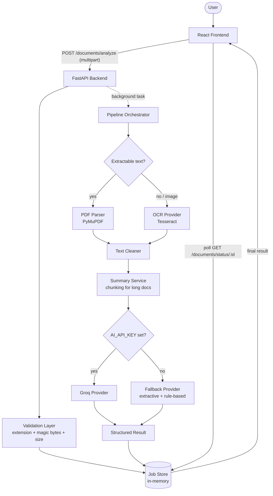

# Document Summary Assistant

Upload a PDF, DOCX, TXT, or scanned image, and get back a structured AI
analysis: a summary (short/medium/long), key points, main ideas, and
dynamic improvement suggestions — all generated from the document's actual
content, never hardcoded.

Built as a technical assessment for a Software Engineering role.

## Overview

The app takes a PDF, DOCX, TXT, or image (JPG/JPEG/PNG), extracts its text
— running scanned pages through OCR automatically when needed — cleans
that text, and sends it to an AI model for structured analysis. If no AI API key is
configured, a real rule-based extractive summarizer runs instead, so the
full pipeline is demoable with zero external dependencies.

## Features

- Drag-and-drop or file-picker upload, with both frontend and backend
  validation (extension, MIME/magic-byte sniffing, size, empty-file checks)
- Six accepted file types: PDF, DOCX, TXT, JPG, JPEG, PNG
- Automatic scanned-PDF detection: PDFs with little/no extractable text
  are routed through OCR instead of failing
- Real, non-simulated processing status (`queued → validating → extracting
  → ocr → cleaning → summarizing → done`), driven by the actual backend job
- Three summary lengths (short/medium/long), regenerable after the fact
  without re-running extraction/OCR
- Key points, main ideas, and improvement suggestions, each generated
  dynamically from the document — suggestions are honestly omitted (not
  invented) when a document has no notable issues
- Long-document chunking: documents estimated over ~6,000 tokens are
  summarized in chunks and combined, rather than blindly sent to the model
- A working fallback summarizer (word-frequency extractive scoring + rule-
  based suggestion heuristics) when no AI API key is configured
- Ask-a-question panel: free-form, **multi-turn** Q&A grounded in the
  document's own text — follow-up questions ("does that apply to
  everyone?") are answered using the conversation so far, with an honest
  "the document doesn't mention that" instead of a guessed answer when the
  document doesn't contain it (works in fallback mode too, via
  keyword-overlap sentence matching, with a simpler previous-question
  fallback for sparse follow-ups)
- Multi-document comparison: compare 2-5 documents analyzed earlier in the
  session for shared themes and differences, without re-uploading them
  (Groq gives a genuine comparative analysis; the fallback path does
  keyword-overlap comparison, honestly reporting when documents have
  little in common rather than forcing a comparison)
- Copy-to-clipboard and download-as-`.txt`/`.md` for results
- Responsive layout, accessible controls, clear error/empty/loading states

## Tech Stack

**Frontend:** React 19, TypeScript, Vite, Tailwind CSS v4
**Backend:** Python 3.11, FastAPI
**Document processing:** PyMuPDF (PDF text + rasterization), Pillow (image
preprocessing), pytesseract (OCR)
**AI:** Groq (OpenAI-compatible chat completions API), with a dependency-free
rule-based fallback
**Testing:** pytest (backend, 120 tests), Vitest + React Testing Library
(frontend, 21 tests)

> **Why Python 3.11, not the latest Python:** this project was built against
> a very new Python release that didn't yet have prebuilt wheels for
> `pydantic-core`/`Pillow` on Windows, so `pip install` fell back to
> building from source and failed. Python 3.11 has broad, stable wheel
> support across every dependency here — use it for the backend venv even
> if a newer Python is on your PATH.

## Architecture



**Why each layer exists:**

- **Validation layer** - the frontend's checks are UX convenience only; the
  backend independently re-validates every upload (extension, magic bytes,
  size) because the frontend can never be trusted.
- **Job store + background pipeline** - document processing (OCR, AI calls)
  can take several seconds. The `analyze` endpoint returns immediately with
  a job ID; the frontend polls for status. This is what makes the
  processing UI show real stages instead of a fake progress bar.
- **PDF parser vs. OCR provider** - kept as separate, swappable pieces.
  `OCRProvider` is an interface (`app/services/ocr/base.py`) so Tesseract
  could be replaced with a hosted OCR API without touching any calling
  code, if a deployment target can't install the Tesseract system binary.
- **Text cleaner** - both extraction paths (PDF and OCR) produce noisy text
  (broken lines, repeated headers/footers, inconsistent unicode). One
  shared cleaning service normalizes both.
- **Summary service** - the seam between "how long is this document" and
  "how do I summarize it." Owns chunking so `AIProvider` implementations
  never have to think about document length.
- **AI provider abstraction** - `SummaryService` depends only on the
  `AIProvider` interface (`app/services/ai/base.py`). `GroqProvider` and
  `FallbackProvider` both implement it, so swapping AI vendors, or running
  with zero AI vendor at all, doesn't touch any other layer.

## Project Structure

```text
document-summary-assistant/
├── frontend/
│   ├── src/
│   │   ├── components/
│   │   │   ├── upload/       DropZone, FilePreview
│   │   │   ├── results/      ResultsDashboard and its panels
│   │   │   └── shared/       ProcessingStatus, ErrorBanner, CopyButton
│   │   ├── hooks/            useDocumentUpload, useDocumentAnalysis, useSummaryRegeneration
│   │   ├── services/         api.ts (fetch wrapper), documentService.ts
│   │   ├── types/             document.ts, api.ts
│   │   ├── utils/            validation, formatters, exportResult
│   │   └── App.tsx
│   └── package.json
│
├── backend/
│   ├── app/
│   │   ├── api/routes/       health.py, documents.py
│   │   ├── services/
│   │   │   ├── ai/           base.py (AIProvider), groq_provider.py, fallback_provider.py,
│   │   │   │                 text_analysis.py, prompts.py, schema.py
│   │   │   ├── ocr/          base.py (OCRProvider), tesseract_provider.py, preprocessing.py
│   │   │   ├── document_processor.py   PDF/image -> raw text
│   │   │   ├── text_cleaner.py
│   │   │   ├── summary_service.py      chunking + provider selection
│   │   │   ├── pipeline.py             full job orchestration
│   │   │   └── job_store.py            in-memory job/progress store
│   │   ├── models/schemas.py           Pydantic request/response models
│   │   ├── utils/                      errors.py, validation.py, file_signature.py,
│   │   │                               filenames.py, background_tasks.py
│   │   ├── config/settings.py
│   │   └── main.py
│   ├── tests/
│   └── requirements.txt
│
├── docs/
│   ├── architecture.md
│   └── API.md
│
├── .env.example
├── .gitignore
└── README.md
```

## Installation

```bash
git clone <repository-url>
cd document-summary-assistant
```

### Backend setup

Requires **Python 3.11** (see the wheel-compatibility note above).

```bash
cd backend
python -m venv venv
venv\Scripts\activate        # Windows
# source venv/bin/activate   # macOS/Linux
pip install -r requirements.txt
cp ../.env.example .env      # then fill in AI_API_KEY (optional, see below)
```

### Frontend setup

```bash
cd frontend
npm install
```

## Environment Variables

Copy `.env.example` to `backend/.env` and adjust as needed:

| Variable | Default | Description |
|---|---|---|
| `AI_API_KEY` | *(empty)* | Groq API key. Leave blank to run the fallback extractive summarizer instead of an LLM. |
| `AI_MODEL` | `openai/gpt-oss-120b` | Groq model name. Check [console.groq.com/docs/models](https://console.groq.com/docs/models) or `GET https://api.groq.com/openai/v1/models` for current options — Groq's lineup changes over time, and this default can go stale (it already replaced one deprecated default during development). |
| `AI_PROVIDER` | `groq` | `groq` or `fallback`. Forced to fallback automatically if `AI_API_KEY` is blank. |
| `AI_REQUEST_TIMEOUT_SECONDS` | `30` | Timeout per Groq request. |
| `OCR_ENABLED` | `true` | Disable to reject scanned PDFs/images with a clear error instead of attempting OCR. |
| `TESSERACT_CMD` | *(empty)* | Path to the Tesseract binary, only needed if it's not on PATH (common on Windows). |
| `MAX_FILE_SIZE` | `10485760` (10 MB) | Max upload size in bytes. |
| `CORS_ALLOW_ORIGINS` | `http://localhost:5173` | Comma-separated list of allowed frontend origins. |
| `ENVIRONMENT` | `development` | `development` / `production` / `test`. |
| `LOG_LEVEL` | `INFO` | Python logging level. |

For the frontend, copy the `VITE_API_BASE_URL` line into `frontend/.env` -
leave it blank in development (the Vite dev server proxies `/api` to
`localhost:8000`, see `frontend/vite.config.ts`); set it to the deployed
backend URL for production builds.

## Running Locally

```bash
# Terminal 1 - backend
cd backend
venv\Scripts\activate
uvicorn app.main:app --reload --port 8000

# Terminal 2 - frontend
cd frontend
npm run dev
```

Frontend: http://localhost:5173 · Backend: http://localhost:8000 · API docs
(auto-generated by FastAPI): http://localhost:8000/docs

## API Documentation

Full request/response schemas are in [`docs/API.md`](docs/API.md). Summary:

| Method | Endpoint | Purpose |
|---|---|---|
| `GET` | `/api/health` | Health check |
| `POST` | `/api/documents/analyze` | Upload + start analysis (202, returns a job ID) |
| `GET` | `/api/documents/status/{job_id}` | Poll job status/stage/result |
| `POST` | `/api/documents/summarize` | Regenerate the summary at a different length |
| `POST` | `/api/documents/ask` | Ask a free-form, multi-turn question about a completed document |
| `POST` | `/api/documents/compare` | Compare 2-5 completed documents |

## OCR Setup

The app uses [Tesseract OCR](https://github.com/tesseract-ocr/tesseract)
via `pytesseract`. It's a **system binary**, not a Python package - install
it separately:

- **Windows:** install from the [UB-Mannheim
  build](https://github.com/UB-Mannheim/tesseract/wiki), then either add it
  to PATH or set `TESSERACT_CMD` in `.env` to the installed `tesseract.exe`
  path.
- **macOS:** `brew install tesseract`
- **Linux (Debian/Ubuntu):** `apt-get install tesseract-ocr`
- **Docker:** add `apt-get install -y tesseract-ocr` to the backend image
  (see the Dockerfile mentioned under Deployment).

If Tesseract isn't installed, OCR-dependent uploads (scanned PDFs, images)
fail with a clear, user-facing message ("OCR is not available on this
server right now...") instead of crashing - this was verified during
development on a machine without Tesseract installed.

**Swapping OCR providers:** `OCRProvider` (`app/services/ocr/base.py`) is a
small interface with one method, `extract_text(image) -> str`. If a
deployment target can't install Tesseract, implement this interface against
a hosted OCR API and swap it in `app/services/document_processor.py`'s
`get_default_ocr_provider` - nothing else needs to change.

## AI Integration

**Provider:** [Groq](https://console.groq.com) was chosen for its free
tier and fast inference. The integration lives entirely behind an
`AIProvider` interface (`app/services/ai/base.py`), so switching providers
means writing one new class, not touching the pipeline.

**Structured output:** the model is prompted to return a single JSON object
(`summary`, `key_points`, `main_ideas`, `improvement_suggestions`), which is
validated with a Pydantic schema (`app/services/ai/schema.py`) before it's
trusted anywhere. Malformed or incomplete JSON is caught and turned into a
clean `502`, never passed through or crashed on.

**Prompt injection defense:** document text is always wrapped in explicit
`<document>` tags with an instruction to treat everything inside as inert
data, never as commands - see `app/services/ai/prompts.py`. Uploaded
documents are untrusted input by definition.

**No API key configured:** `SummaryService` automatically uses
`FallbackProvider`, a dependency-free extractive summarizer:
word-frequency sentence scoring picks the summary/key points/main ideas
(every sentence it returns is a literal excerpt from the document - nothing
is generated), and improvement suggestions come from measurable properties
of the document (word count, missing conclusion markers, repeated
sentences, very long average sentence length). Quality is naturally lower
than an LLM's; this is expected and shown transparently in the UI (a
"Fallback summarizer" badge on the results dashboard).

**Long documents:** documents estimated over ~6,000 tokens are split into
~4,000-token paragraph-aware chunks, each summarized individually, and the
combined chunk summaries are passed through one final analysis pass. Short
documents (the common case) skip this entirely and go straight to a single
AI call. See `app/services/summary_service.py`.

## Testing

```bash
# Backend
cd backend
venv\Scripts\activate
pytest

# Frontend
cd frontend
npm test
```

Backend (120 tests) covers file validation (extension/MIME/magic-byte
spoofing/size, including DOCX/TXT), PDF/DOCX/TXT extraction (including
scanned-PDF detection), OCR (including the "Tesseract not installed"
failure path), text cleaning (dehyphenation, paragraph preservation,
header/footer stripping), the fallback summarizer's heuristics (Q&A
keyword matching, sparse-follow-up continuity, comparison keyword
overlap), the Groq provider (mocked - malformed JSON, schema mismatches,
rate limits, timeouts, auth failures, multi-turn message construction),
chunking, the full job pipeline, and the API layer end-to-end (including
multi-turn Q&A and document comparison).

Frontend (21 tests) covers file selection, invalid-file rejection with no
network call, the real processing-status flow, results rendering, asking
a question about a completed document, and comparing two documents
analyzed in the same session, using mocked `fetch` rather than hitting a
real backend.

### Test documents

The automated backend tests don't need fixture files - they build small
real PDFs/images on the fly with PyMuPDF/Pillow. For manual testing through
the UI, any real PDF, JPG, or PNG works. A few that exercise different
paths well:

- A text-based PDF (a report, article, or paper with a few pages) - exercises
  direct PDF extraction, no OCR.
- A scanned/photographed document, or any PDF made purely of scanned pages -
  exercises the scanned-PDF detection + OCR path.
- A phone photo of a printed page (JPG/PNG) - exercises the image-upload
  OCR path plus preprocessing (grayscale/contrast/upscaling).
- A very short document (a paragraph or two) and a long one (10+ pages) -
  exercise the fallback summarizer's length heuristics and the AI chunking
  path, respectively.

## Deployment

Not deployed - the instructions below are for whoever runs this.

**Frontend (Vercel or Netlify):** build with `npm run build` in `frontend/`,
publish the `dist/` folder, and set `VITE_API_BASE_URL` to the deployed
backend's URL as a build-time environment variable.

**Backend:** needs a host that can install the Tesseract system package,
which rules out most pure-serverless functions. Render, Railway, or Fly.io
(via [`backend/Dockerfile`](backend/Dockerfile)) all work:

```bash
cd backend
docker build -t document-summary-backend .
docker run -p 8000:8000 --env-file .env document-summary-backend
```

> Docker wasn't available in the environment this was built in, so the
> image above hasn't actually been built and run - it follows the standard,
> well-established pattern for a slim Python + apt-get setup, but verify it
> builds cleanly before relying on it.

Set the environment variables from the table above on the host, especially
`AI_API_KEY` and `CORS_ALLOW_ORIGINS` (must include the deployed frontend's
origin, or the browser will block requests).

## Error Handling

Every user-facing error returns `{"error": "<code>", "message": "<friendly
text>"}` with an appropriate HTTP status - never a Python traceback or raw
exception message. Handled cases include: unsupported file type, empty
file, oversized file, content that doesn't match its extension (magic-byte
mismatch), corrupted/password-protected PDFs, OCR unavailable/failed, no
extractable text, AI timeout, AI rate limit, malformed AI output, and a
generic 500 fallback for anything unexpected (logged server-side, generic
message client-side).

## Design Decisions

- **In-memory job store, no database.** This is a single-instance demo app;
  a database would be unjustified complexity for the actual requirement.
  Documented as a limitation below.
- **Async job + polling instead of a single blocking request.** Document
  processing can take several seconds; a job ID + status polling lets the
  UI show real progress instead of a spinner with no information.
- **`/documents/summarize` regenerates only the summary**, not key
  points/main ideas/suggestions - those don't logically depend on summary
  length, so regenerating them would be a wasted AI call.
- **Documents are processed entirely in memory** (`io.BytesIO`, not temp
  files on disk) - both PyMuPDF and Pillow support this directly, which
  sidesteps an entire class of temp-file-cleanup bugs.
- **Hand-rolled magic-byte sniffing instead of `python-magic`** - the
  accepted file set is small and fixed (PDF/JPEG/PNG), and `python-magic`
  needs the system `libmagic` library, which complicates Windows setup for
  no real benefit here.
- **No `nltk`/`spacy` for the fallback summarizer** - a small hand-rolled
  stopword list and regex sentence splitter are enough for frequency-based
  scoring, and avoid a large model download for a path that exists
  specifically to work with zero external dependencies.

## Limitations

- The in-memory job store is single-process and has no eviction/TTL -
  completed jobs stay in memory until the process restarts. Fine for a demo
  or single-instance deployment; not production-scale.
- No persistent history - closing the tab loses the result (download/copy
  before navigating away).
- OCR preprocessing is intentionally simple (grayscale, contrast, upscale)
  - no deskewing or advanced denoising.
- The fallback summarizer's quality is meaningfully lower than an LLM's;
  it's a transparency-first demo path, not a production summarization
  algorithm.
- No authentication/rate limiting - out of scope for this assessment.
- Chunking uses a character-based token estimate, not a real tokenizer for
  the specific model in use - a reasonable approximation, not exact.
- The "documents available to compare" list lives in frontend React state
  only - it resets on page reload, same as the rest of the app's session
  state. Comparison is capped at 5 documents at a time.
- Multi-turn Q&A history (last 6 exchanges) is stored per-job in the same
  in-memory job store as everything else, so it shares that store's
  restart/single-instance limitations above.

## Future Improvements

- Redis/database-backed job store with TTL cleanup, for multi-instance
  deployment
- Server-Sent Events instead of polling for job status
- A second `AIProvider` implementation (e.g. OpenAI/Anthropic) to prove out
  the abstraction further
- A second `OCRProvider` implementation (hosted OCR API) for platforms that
  can't install Tesseract
- Persistent analysis history per user
- PDF deskewing and more advanced OCR preprocessing
