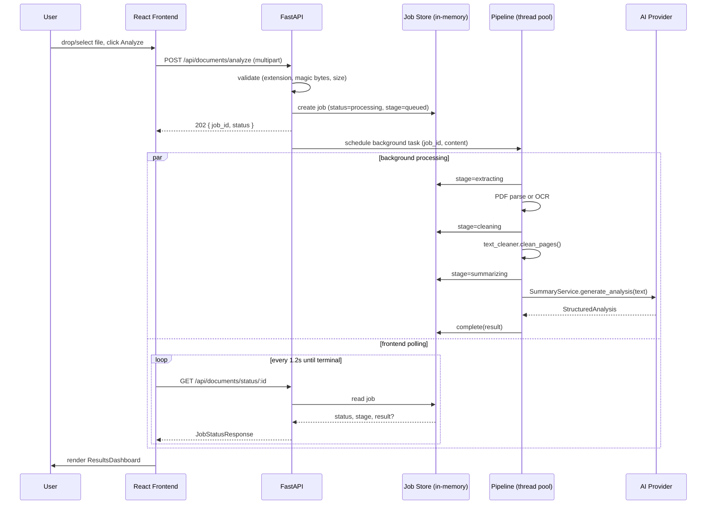

# Architecture

## Request flow



## Why a job store instead of a blocking request

Document processing (PDF/OCR extraction plus one or more AI calls) can take
anywhere from tens of milliseconds to several seconds. Two options were
considered:

1. **Block the HTTP request until processing finishes**, returning the full
   result synchronously.
2. **Return immediately with a job ID**, run processing in the background,
   and let the frontend poll for status.

Option 2 was chosen because the assessment explicitly calls for a real,
non-fake processing UI (`✓ File validated / ● Generating summary...`). A
blocking request gives the frontend nothing to reflect until the very end;
a job store gives it real, incrementally-updated state to poll.

The store itself (`app/services/job_store.py`) is a plain `dict` guarded by
a `threading.Lock`, not Redis or a database. That's a deliberate scope
decision for a single-instance app - see the README's Limitations section
for what would need to change for multi-instance deployment.

**A note on `asyncio.create_task`:** the background task is scheduled with
a helper (`app/utils/background_tasks.py`) that keeps a strong reference to
the task until it finishes. `asyncio.create_task()` alone only holds a
*weak* reference from the event loop - a task with nothing else referencing
it can be garbage-collected mid-execution. This was caught by the backend
test suite (a status-polling test that intermittently never reached a
terminal state), not by manual testing, which is exactly the kind of bug
automated tests exist to catch.

## The extraction pipeline

```
Upload bytes
    │
    ▼
extension == ".pdf"?
    │                              │
   yes                             no (.jpg/.jpeg/.png)
    │                               │
PyMuPDF: extract per-page text      │
    │                               │
avg chars/page < 20?                │
    │            │                  │
   no           yes                 │
    │            │                  │
    │      render pages to images   │
    │            │                  │
    │      Tesseract OCR ───────────┤
    │            │                  │
    └────────────┴──────────────────┘
                 │
                 ▼
         text_cleaner.clean_pages()
     (dehyphenate, collapse whitespace,
      strip repeated headers/footers,
      unicode-normalize, keep paragraph
      breaks)
                 │
                 ▼
         SummaryService.generate_analysis()
```

`extract_document_text` (`app/services/document_processor.py`) is the single
function that decides PDF-vs-OCR-vs-image and returns raw per-page text; it
takes an `OCRProvider` as a parameter rather than importing Tesseract
directly, which is what makes it independently testable with a fake OCR
provider (see `tests/test_document_processor.py`) and swappable in
production.

## The AI layer

```
AIProvider (interface)
    ├── GroqProvider       - calls Groq's chat completions API, JSON mode,
    │                         validates the response against a Pydantic
    │                         schema before trusting it
    └── FallbackProvider   - word-frequency extractive scoring + rule-based
                              suggestion heuristics, zero external calls

SummaryService
    - owns provider selection (get_ai_provider(settings))
    - owns chunking: estimates token count, and for documents over the
      threshold, splits into paragraph-aware chunks, summarizes each via
      provider.generate_summary(), then runs one final
      provider.generate_analysis() pass over the combined chunk summaries
```

Nothing above `SummaryService` (the pipeline, the API routes) ever imports
`GroqProvider` or `FallbackProvider` directly - they only see
`AIProvider`. This is what makes "no AI API key configured" a supported,
tested configuration rather than a special case scattered through the
codebase: `get_ai_provider()` is the only place that branches on it.

## Job stage machine

```
queued → validating → extracting → [ocr] → cleaning → summarizing → done
                                              │
                                              └─ (any stage) → failed
```

Every transition in this diagram corresponds to a real line of code writing
to the job store (`store.set_stage(...)`) - there is no stage the frontend
can observe that wasn't actually reached by the backend. `ocr` is only
entered for scanned PDFs or image uploads; text-based PDFs skip straight
from `extracting` to `cleaning`.
